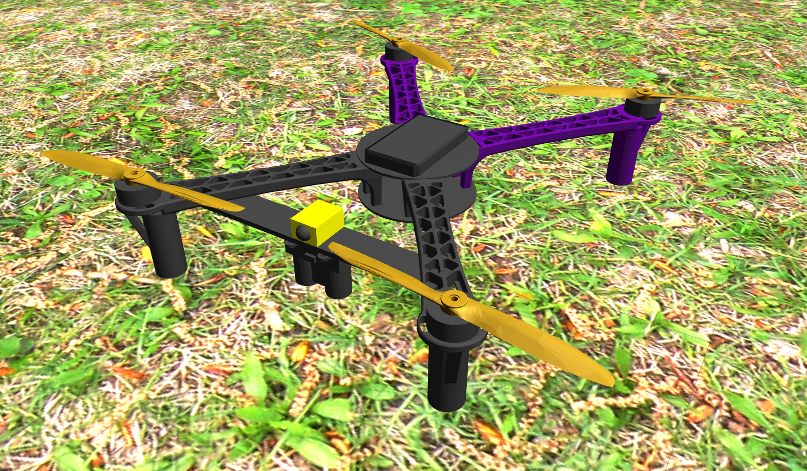

# pairs_gazebo_custom_drone_example

A worked example showing how to add your own custom multirotor model to the PAIRS Gazebo simulation. It bundles a complete sample drone — a Jinja-templated SDF model with meshes, a matching PX4 airframe, and a spawner configuration — so you can see every piece needed to fly a new airframe in the [PAIRS UAV System](https://github.com/pairs-lab/pairs_uav_system) and use it as a template for your own.



It walks through:

- Setting up a custom resource directory
- Building a model template in Jinja
- Configuring a custom PX4 airframe
- Registering the drone with the PAIRS drone spawner
- Running the simulation with the PAIRS UAV System
- Adding an optional sensor that the spawner can toggle on or off

## Contents

* `models/my_drone/` — the example drone: Jinja SDF templates (`my_drone.sdf.jinja`, `custom_macros.sdf.jinja`) and meshes (arm, propeller).
* `ROMFS/px4fmu_common/` — the PX4 airframe definition for the drone (`4041_my_drone`) and supporting init scripts.
* `tmux/` — a plain-tmux `simulation` session (`start.sh` / `kill.sh`) that brings up Gazebo, the PAIRS control stack, and spawns the custom drone.

The package exports its `models/` directory to Gazebo so the model can be referenced via `model://`.

## Install (ROS 1 Noetic)

```bash
sudo apt install ros-noetic-pairs-gazebo-custom-drone-example
```

## Usage

Run the full example from its tmux session:

```bash
cd tmux
./start.sh   # ./kill.sh to stop
```

The drone is spawned with the PAIRS drone spawner. Optional components (laser rangefinder, custom monochrome camera, ground-truth publisher) are enabled through spawner flags:

```bash
rosservice call /pairs_drone_spawner/spawn "1 --$UAV_TYPE"
rosservice call /pairs_drone_spawner/spawn "1 --$UAV_TYPE --enable-ground-truth --enable-rangefinder --enable-custom-monochrome-camera"
```

The simulation starts three state estimators: `gps_baro` (works with no extra sensors), `gps_garmin` (uses the rangefinder for more precise altitude), and `passthrough` (uses ground-truth data for the highest accuracy). These can be enabled or disabled in `tmux/config/custom_config.yaml`.
